# Coffee Shop UML Diagram

## Table of Contents
1. [Entity Relationship Diagram](#entity-relationship-diagram) - Database schema and relationships
2. [Domain Entities](#domain-entities) - Core business objects and models
3. [Data Access Layer](#data-access-layer) - Repositories and DbContext
4. [Business Logic Layer](#business-logic-layer) - Services and interfaces
5. [Presentation Layer](#presentation-layer) - Controllers and API endpoints
6. [Data Transfer Objects (DTOs)](#data-transfer-objects-dtos) - API request/response models
7. [Architecture Overview](#architecture-overview) - Full-stack application architecture
8. [Key Features & Patterns](#key-features--patterns) - Implementation details

---

## Entity Relationship Diagram

## Domain Entities

Core business objects that represent the application's data model.

## Data Access Layer

Repository pattern implementation and Entity Framework DbContext for database operations.

## Business Logic Layer

Services and interfaces that implement business logic and domain operations.

## Presentation Layer

Controllers that handle HTTP requests and coordinate between the presentation and business layers.

```mermaid
classDiagram
    class BaseApiController {
        <<abstract>>
    }
    
    class AccountController {
        -UserManager~AppUser~ userManager
        -ITokenService tokenService
        +Register(RegisterDto) Task~ActionResult~UserDto~~
        +Login(LoginDto) Task~ActionResult~UserDto~~
        +RefreshToken() Task~ActionResult~UserDto~~
        +GetCurrentUser() Task~ActionResult~UserDto~~
    }
    
    class MenuItemsController {
        -AppDbContext context
        +GetMenuItems() Task~ActionResult~List~MenuItem~~~
        +GetMenuItem(string) Task~ActionResult~MenuItem~~
        +CreateMenuItem(MenuItemCreationDto) Task~ActionResult~MenuItem~~
        +UpdateMenuItem(string, MenuItemCreationDto) Task~ActionResult~
        +DeleteMenuItem(string) Task~ActionResult~
    }
    
    class OrderController {
        -AppDbContext context
        +CreateOrder(OrderCreationDto) Task~ActionResult~Order~~
        +GetOrders() Task~ActionResult~List~Order~~~
        +GetOrderById(int) Task~ActionResult~Order~~
        +UpdateOrderStatus(int, OrderStatus) Task~ActionResult~
    }
    
    class UsersController {
        -UserManager~AppUser~ userManager
        +GetUsers() Task~ActionResult~IEnumerable~AppUser~~~
        +GetUser(string) Task~ActionResult~AppUser~~
    }
    
    class AdminController {
        -UserManager~AppUser~ userManager
        +GetUsersWithRoles() Task~ActionResult~
        +EditRoles(string, string) Task~ActionResult~
    }
    
    %% Relationships
    BaseApiController <|-- AccountController
    BaseApiController <|-- MenuItemsController
    BaseApiController <|-- OrderController
    BaseApiController <|-- UsersController
    BaseApiController <|-- AdminController
    
    AccountController --> UserManager
    AccountController --> ITokenService
    MenuItemsController --> AppDbContext
    OrderController --> AppDbContext
    UsersController --> UserManager
    AdminController --> UserManager
```

## Data Transfer Objects (DTOs)

## Architecture Overview

## Key Features & Patterns

### 1. **Authentication & Authorization**
- ASP.NET Core Identity integration
- JWT token-based authentication
- Role-based authorization (Customer, Employee, Admin)
- Refresh token support

### 2. **Entity Framework Patterns**
- Code-First approach with migrations
- Foreign key + Navigation property pattern
- Repository pattern implementation
- DbContext inheritance from IdentityDbContext

### 3. **API Design Patterns**
- RESTful API endpoints
- DTO (Data Transfer Object) pattern
- Controller inheritance from BaseApiController
- Swagger/OpenAPI documentation

### 4. **Domain Model**
- Rich domain entities with computed properties (TotalAmount)
- Enum usage for type safety (OrderStatus)
- Proper entity relationships and foreign keys
- Photo entity for file management

### 5. **Cross-Cutting Concerns**
- Global exception handling middleware
- CORS configuration for Angular client
- JSON serialization configuration
- Reference cycle handling